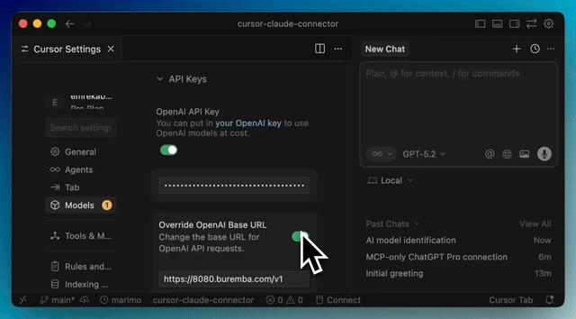
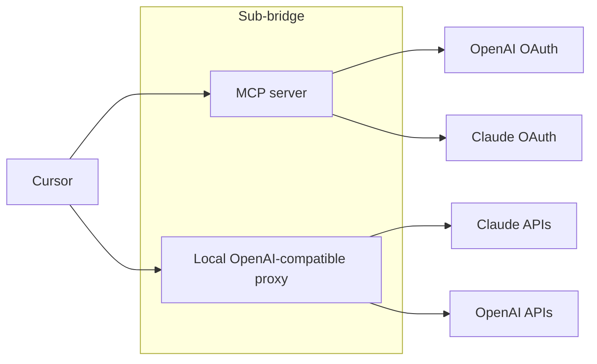

# Sub Bridge

Use ChatGPT Pro/Max, Claude Max, etc. directly in Cursor via an MCP-managed OpenAI-compatible proxy.

[](https://buremba.github.io/sub-bridge/)

## Why Sub Bridge

- Subscriptions win: Claude Code and ChatGPT Max typically deliver 3x to 5x more tokens per dollar than usage pricing.
- Use existing subscriptions: keep what you already pay for and route usage into Cursor.
- Keep Cursor UX: chat, agents, and tools continue to work; autocomplete still needs a Cursor plan.

## Quick Start

1. Install the MCP server:

<a href="https://buremba.github.io/sub-bridge/install"></a>

2. Ask chat to connect ChatGPT Pro or Claude Max and login with your credentials locally and generate API Key for Cursor locally.


3. Finish setup in Cursor (two steps side-by-side)

<table>
  <tr>
    <td align="center"><strong>Install Sub Bridge in Cursor</strong></td>
    <td align="center"><strong>Paste the Base URL and API key</strong></td>
  </tr>
  <tr>
    <td align="center"></td>
    <td align="center"></td>
  </tr>
</table>

## Docker (all-in-container)

This runs both the MCP proxy and HTTP server inside Docker and keeps the Codex/ChatGPT subscription flow local.

1. Build the image:

```bash
docker build -t sub-bridge:local .
```

2. Add the MCP server in Cursor using Docker (stdio) under `mcpServers`:

```json
"sub-bridge": {
  "autoApprove": [],
  "disabled": false,
  "command": "docker",
  "env": {},
  "transportType": "stdio",
  "args": [
    "run",
    "--rm",
    "-i",
    "--read-only",
    "--tmpfs",
    "/tmp",
    "--cap-drop",
    "ALL",
    "--security-opt",
    "no-new-privileges:true",
    "-p",
    "127.0.0.1:8787:8787",
    "-v",
    "sub_bridge_data:/home/node/.sub-bridge",
    "-v",
    "/ABS/PATH/TO/CODEX:/workspace:ro",
    "sub-bridge:local"
  ]
}
```

3. Open `http://localhost:8787` and log in to ChatGPT (Codex) and/or Claude.
4. Use the generated API key in Cursor with base URL `http://localhost:8787/v1`.

Notes:
- The Codex/ChatGPT OAuth token is wrapped into an `sb1.*` key and encrypted with a local secret stored at `/home/node/.sub-bridge/secret.key`. The named volume keeps this stable across container restarts.
- The `/ABS/PATH/TO/CODEX` mount is read-only and optional; it is included here to keep your code accessible in-container if needed.
- For custom routing, set `CHATGPT_BASE_URL` and `CHATGPT_DEFAULT_MODEL` via environment variables.

### Tunnels (optional)

You do **not** need a tunnel for normal local use. A tunnel is only required when the client that must reach Sub Bridge cannot access your localhost (for example, Cursor running on a different machine or a remote dev environment).

Enabling a tunnel exposes your local Sub Bridge server via a public URL. Anyone who can reach that URL can hit your instance, so only enable this if you need remote access.

### Docker Compose (optional)

Edit `compose.yaml` to set your codex folder path, then run:

```bash
docker compose build
docker compose run --rm --service-ports sub-bridge
```

## How it works



Sub Bridge is an MCP server that includes OpenAI API proxy. It lets you login with Claude or ChatGPT and generate API keys for the proxy, which then set in Cursor Settings as an external provider. 

The proxy uses Codex and Claude Code specific instructions that enables you to use Cursor with your local credentials.

## API key format and parsing

Sub Bridge reads the `Authorization: Bearer ...` header and supports multiple tokens so you can route Cursor models to Claude while still passing an OpenAI or ChatGPT token.

Rules:
- Tokens are space-separated. Comma separation is supported as a fallback.
- A routed key contains mappings before the last `:` and the API key after it.
- A mapping is `cursor_model=claude_model`, and multiple mappings are comma-separated.
- A plain token (no `=`) is treated as the default key.
- If a token contains `#account_id`, the suffix is used as the ChatGPT account id.
- Model aliases `opus-4.5` and `sonnet-4.5` expand to their full Claude model IDs.
- If the default key is a JWT or has an account id, requests go to the ChatGPT backend; otherwise they go to the OpenAI API.

Examples:

```text
Authorization: Bearer o3=opus-4.5,o3-mini=sonnet-4.5:sk-ant-xxx sk-openai-xxx
```

Routes `o3` and `o3-mini` to Claude using `sk-ant-xxx`, while `sk-openai-xxx` becomes the default token.

```text
Authorization: Bearer o3=opus-4.5:sk-ant-xxx,sk-openai-xxx
```

Comma fallback: splits into a routed Claude token plus a default token.

```text
Authorization: Bearer sk-chatgpt-xxx#account_id
```

Single default token routed to the ChatGPT backend.

## Known Limitations

- **Image/file uploads in Cursor chat may not work** due to a [Cursor bug](https://github.com/cursor/cursor/issues/3390) that validates API keys against OpenAI's servers even with a custom base URL. See [#15](https://github.com/buremba/sub-bridge/issues/15) for details and workarounds.
