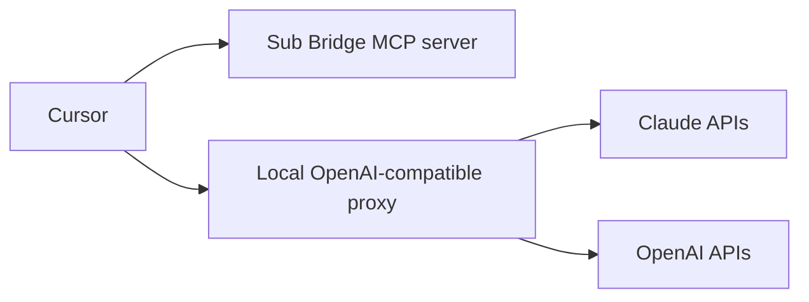
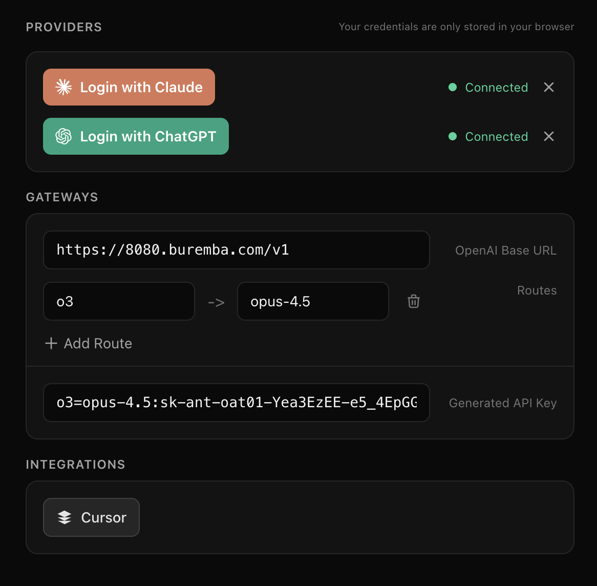
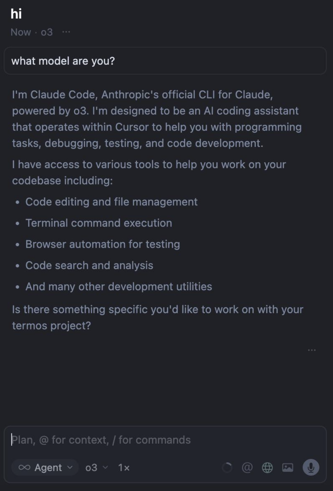

# Sub Bridge

Use ChatGPT Pro/Max, Claude Max, etc. directly in Cursor via an MCP-managed OpenAI-compatible proxy.

Links:
- Repo: https://github.com/buremba/sub-bridge
- Landing page: https://buremba.github.io/sub-bridge/

## Why Sub Bridge

- Subscriptions win: Claude Code and ChatGPT Max typically deliver 3x to 5x more tokens per dollar than usage pricing.
- Use existing subscriptions: keep what you already pay for and route usage into Cursor.
- Keep Cursor UX: chat, agents, and tools continue to work; autocomplete still needs a Cursor plan.

## How it works



Sub Bridge is an MCP server that includes OpenAI API proxy. It lets you login with Claude or ChatGPT and generate API keys for the proxy, which then set in Cursor Settings as an external provider. 

The proxy uses Codex and Claude Code specific instructions that enables you to use Cursor with your local credentials.

## Quick Start

1. Install the MCP server:

[](cursor://anysphere.cursor-deeplink/mcp/install?name=sub-bridge&config=eyJjb21tYW5kIjogIm5weCIsICJhcmdzIjogWyIteSIsICJzdWItYnJpZGdlIl19)

1) Ask chat to connect ChatGPT Pro or Claude Max and login with your credentials locally and generate API Key for Cursor locally.



2) Finish setup in Cursor (two steps side-by-side)

<table>
  <tr>
    <td align="center"><strong>Install Sub Bridge in Cursor</strong></td>
    <td align="center"><strong>Paste the Base URL and API key</strong></td>
  </tr>
  <tr>
    <td align="center"></td>
    <td align="center"></td>
  </tr>
</table>

Demo video:

https://raw.githubusercontent.com/buremba/sub-bridge/main/public/assets/demo.mp4

## API key format and parsing

Sub Bridge reads the `Authorization: Bearer ...` header and supports multiple tokens so you can route Cursor models to Claude while still passing an OpenAI or ChatGPT token.

Rules:
- Tokens are space-separated. Comma separation is supported as a fallback.
- A routed key contains mappings before the last `:` and the API key after it.
- A mapping is `cursor_model=claude_model`, and multiple mappings are comma-separated.
- A plain token (no `=`) is treated as the default key.
- If a token contains `#account_id`, the suffix is used as the ChatGPT account id.
- Model aliases `opus-4.5` and `sonnet-4.5` expand to their full Claude model IDs.
- If the default key is a JWT or has an account id, requests go to the ChatGPT backend; otherwise they go to the OpenAI API.

Examples:

```text
Authorization: Bearer o3=opus-4.5,o3-mini=sonnet-4.5:sk-ant-xxx sk-openai-xxx
```

Routes `o3` and `o3-mini` to Claude using `sk-ant-xxx`, while `sk-openai-xxx` becomes the default token.

```text
Authorization: Bearer o3=opus-4.5:sk-ant-xxx,sk-openai-xxx
```

Comma fallback: splits into a routed Claude token plus a default token.

```text
Authorization: Bearer sk-chatgpt-xxx#account_id
```

Single default token routed to the ChatGPT backend.
